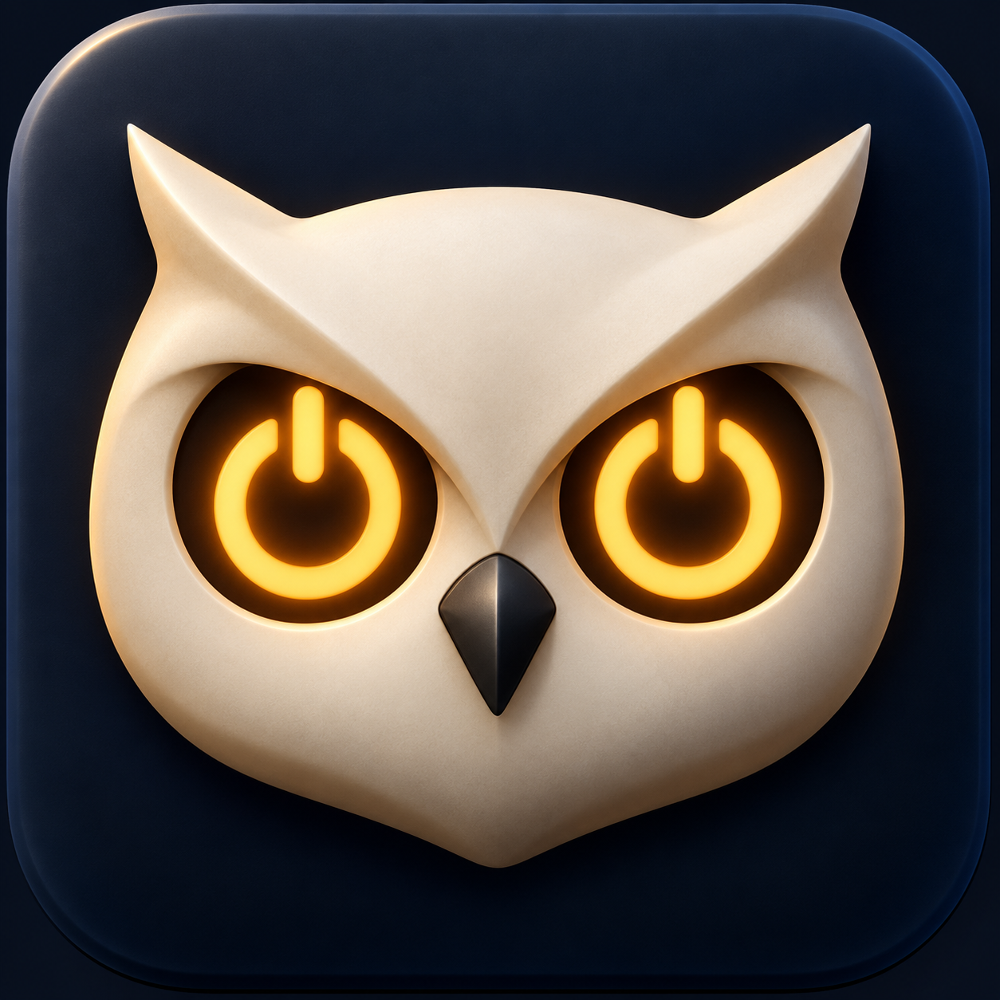

# KeepAwakeBar



A tiny native macOS menu bar app that keeps your Mac awake. Two independent switches, an expressive owl, and no Dock icon.

**[Download KeepAwakeBar](https://github.com/vovalukashov/KeepAwakeBar/releases)** · macOS 13+ · Apple Silicon and Intel

> **Signed release:** the current download is signed with Developer ID and notarized by Apple. Gatekeeper acceptance and the attached notarization ticket have been verified. See the [installation instructions](INSTALL.txt) and [verification notes](VERIFICATION.md).

## How it works

The menu contains just **Caffeinate**, **Disable Sleep**, and **Quit**. A checkmark means that mode is enabled.

- **Caffeinate** runs a dedicated `caffeinate` process owned by the app.
- **Disable Sleep** toggles the system-wide `pmset disablesleep` setting.
- **Quit** stops the app and its own Caffeinate process.

The owl shows the current mode:

- **Closed eyes:** both modes are off.
- **Open eyes:** Caffeinate is on.
- **Huge eyes:** Disable Sleep is on, including when both modes are enabled.

If the system sleep state is unknown, the owl uses open eyes and its tooltip explains that the state is unknown. Disable Sleep remains unavailable until authorization finishes and the system state can be read.

**Quitting does not reset Disable Sleep.** Turn it off when you no longer need it, especially before uninstalling. Do not put an awake Mac in a bag: it can overheat and drain its battery. Caffeinate alone does not guarantee operation with the lid closed.

To restore normal system sleep manually:

```sh
sudo /usr/bin/pmset -a disablesleep 0
```

## Install

1. Download the DMG from [Releases](https://github.com/vovalukashov/KeepAwakeBar/releases).
2. Drag **KeepAwakeBar** to **Applications**.
3. Eject the disk image and open the app from Applications.
4. Look for the owl in the menu bar. There is no main window or Dock icon.
5. Approve the macOS administrator prompt to enable Disable Sleep.

Download the signed release dated October 7, 2026 or later; older releases were ad-hoc signed. macOS may show its normal first-launch confirmation for an app downloaded from the Internet. On a managed Mac, contact your IT team if installation is restricted.

## Administrator authorization

At startup, macOS requests administrator authorization through AppleScript's `do shell script … with administrator privileges`. The app never receives or stores your password. macOS may temporarily cache the authorization.

Only the small `KeepAwakeBarHelper` runs with elevated privileges; the app itself runs as your normal user. Authorization is intended to last for that app session, so changing Disable Sleep does not require a new password prompt each time. Caffeinate works independently of administrator authorization. If you cancel the prompt, restart the app to try again.

The helper accepts only a connection check and two operations:

```sh
/usr/bin/pmset -a disablesleep 1
/usr/bin/pmset -a disablesleep 0
```

It does not accept arbitrary commands or arguments. Communication uses a local Unix socket with a random name, owned by root in the sticky `/private/tmp` directory. The helper checks the client's kernel-provided UID and PID and the process start time; the client checks that the server runs as root. The helper watches the app process through `kqueue` and exits when that process exits. It also exits after 60 seconds if the app never connects.

No persistent daemon, sudoers changes, or saved password are used. Errors appear in a separate dialog. Quit is unavailable while authorization or a system sleep change is in progress.

The implementation lives in `Helper/main.c` and `KeepAwakeBar/Core/SessionSleepAuthorizer.swift`. The older `AppleScriptSleepAuthorizer` remains as a separate adapter but is no longer used by the UI. A future version could replace the session adapter with SMAppService/XPC.

The app reads `pmset -g` at startup, when the menu opens, and every 15 seconds. If the key is absent, it reads the `SleepDisabled` property from `IOPMrootDomain`. It verifies the state again after each change.

## Caffeinate options

By default, the app runs:

```sh
/usr/bin/caffeinate -d -i -m -s -u -w <app-PID>
```

- `-d`: prevents display sleep.
- `-i`: prevents idle system sleep.
- `-m`: prevents disk idle sleep; its relevance depends on the storage device.
- `-s`: prevents system sleep **while connected to AC power**.
- `-u`: signals user activity and may wake the display. Without `-t`, this assertion lasts **five seconds**, not the entire process lifetime.
- `-w`: releases the assertions when the app process exits, including after a crash.

Defaults are defined in `KeepAwakeBar/Core/CaffeinateOptions.swift`. The menu intentionally has only two switches; previously saved flag preferences are still respected.

Caffeinate starts off on a normal launch. The optional `--resume-caffeinate` launch argument starts it with the saved flags when relaunching after an update; it does not enable automatic startup on subsequent launches.

The app tracks only its own `Process`, detects unexpected termination, and never searches for or stops other Caffeinate instances. Quit sends SIGTERM only to its own child process.

## Build in Xcode

1. Open `KeepAwakeBar.xcodeproj`, not `Package.swift` (the latter is for Core tests).
2. Select the **KeepAwakeBar** scheme and **My Mac** destination.
3. In **Signing & Capabilities**, use **Sign to Run Locally** or select your Development Team. Change the bundle identifier if needed.
4. Press **⌘R**.
5. To install your build, choose **Product → Show Build Folder in Finder**, open **Products → Debug/Release**, and copy `KeepAwakeBar.app` to Applications.

The Xcode project is included, so XcodeGen is not required. To regenerate it from `project.yml`, run `xcodegen generate`.

App Sandbox is disabled because the app launches an administrator-authorized helper. Hardened Runtime is enabled. The app has no third-party runtime dependencies. Local signing does not replace Developer ID signing and notarization for distribution.

From the repository directory:

```sh
xcodebuild -project KeepAwakeBar.xcodeproj -scheme KeepAwakeBar \
  -configuration Release -derivedDataPath /tmp/KeepAwakeBar-build \
  CODE_SIGN_IDENTITY=- build
```

The app will be at `/tmp/KeepAwakeBar-build/Build/Products/Release/KeepAwakeBar.app`.

## Project structure

```text
KeepAwakeBar.xcodeproj/          Xcode project and shared scheme
KeepAwakeBar/
  KeepAwakeBarApp.swift          MenuBarExtra, menu, app termination
  AppModel.swift                UI state, refresh, saved preferences
  Info.plist                    LSUIElement and app metadata
  Assets.xcassets/              App icon and three owl states
  Core/
    CommandRunner.swift         Asynchronous system command execution
    SystemSleepService.swift    State reading and authorization interface
    SessionSleepAuthorizer.swift  Session helper connection and authorization
    CaffeinateController.swift  App-owned process lifecycle
    CaffeinateOptions.swift     Typed command flags
    OwlState.swift              Icon state and mode priority
Helper/main.c                   Temporary privileged helper
Tests/KeepAwakeCoreTests/        Core logic and process tests
Design/                         Icon source assets
Package.swift                   Swift package for Core tests
project.yml                     Optional XcodeGen project definition
```

The menu bar icons use transparent template images at 1×, 2×, and 3× scales. The Finder icon is the dimensional owl in `Design/OwlAppIcon.png`. Earlier SVG designs are preserved in `Design/`.

## Testing

```sh
swift test --package-path . --scratch-path /tmp/KeepAwakeBar-tests
```

Tests cover `pmset` parsing, unknown states, fixed authorization commands, flags, exit codes, actual state reading, app-owned Caffeinate startup and shutdown, preservation of an independent process, and all owl mode combinations. Process tests use only `-i` briefly and do not change global power settings.

Manual checks for the privileged flow:

1. Approve administrator authorization at startup. Toggle Disable Sleep repeatedly; no additional authorization prompts should appear during that session.
2. Compare the state with `pmset -g`. If the key is absent, inspect `SleepDisabled` in `ioreg -r -d 1 -c IOPMrootDomain`.
3. After toggling Disable Sleep, verify the result and restore the original state.
4. Enable Caffeinate and inspect its process and `pmset -g assertions`. Disable it and verify that only its own process exits.
5. Test both modes together and quit the app. The system setting persists; the app-owned Caffeinate process and session helper should exit.

Automated tests do not verify interactive administrator approval or physical lid-close behavior. See [VERIFICATION.md](VERIFICATION.md) for what has and has not been checked.

## References

- [Apple: MenuBarExtra and LSUIElement](https://developer.apple.com/documentation/swiftui/menubarextra)
- [Apple: Calling Command-Line Tools](https://developer.apple.com/library/archive/documentation/LanguagesUtilities/Conceptual/MacAutomationScriptingGuide/CallCommandLineUtilities.html)
- [Apple: AppleScript Commands Reference](https://developer.apple.com/library/archive/documentation/AppleScript/Conceptual/AppleScriptLangGuide/reference/ASLR_cmds.html)
- Local `man caffeinate`, `man pmset`, and the installed SDK's IOKit headers.
